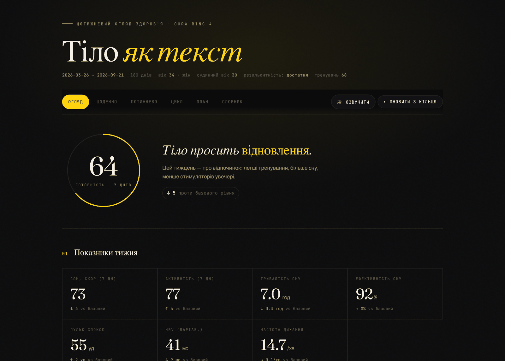
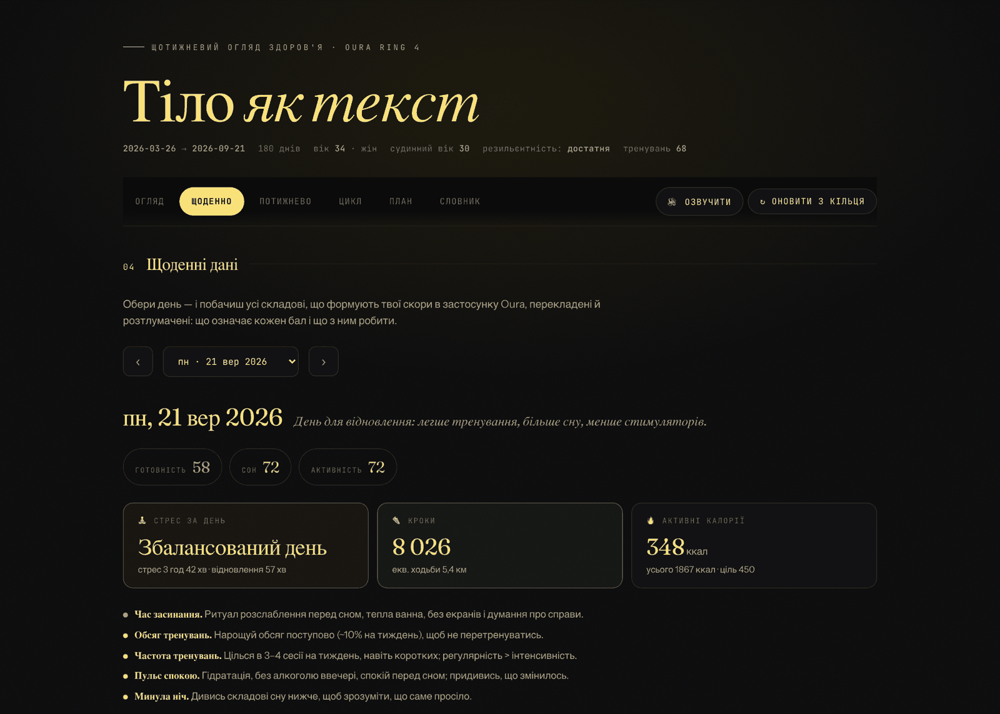
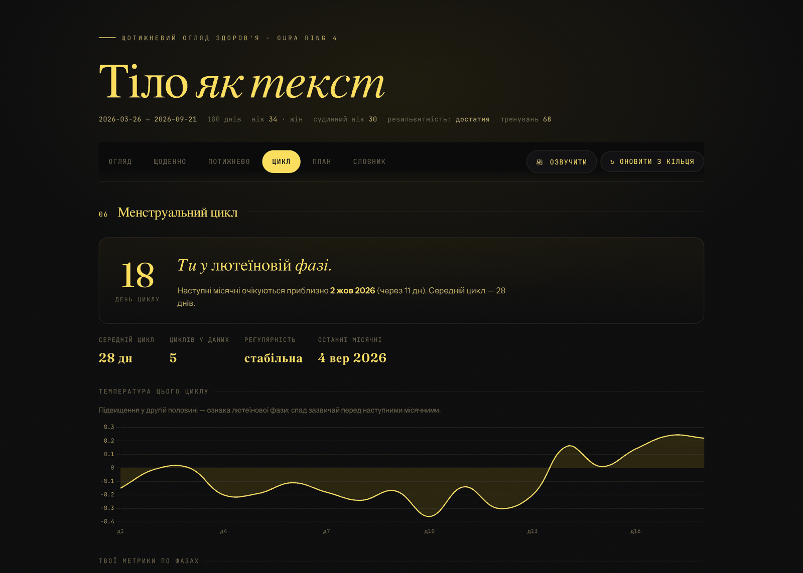
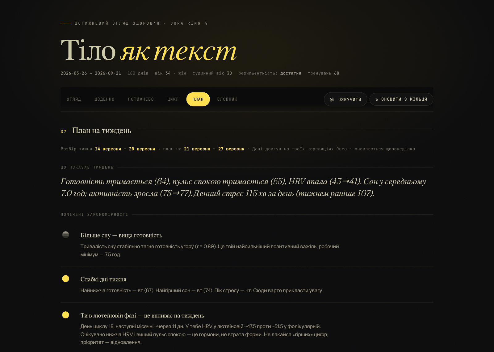
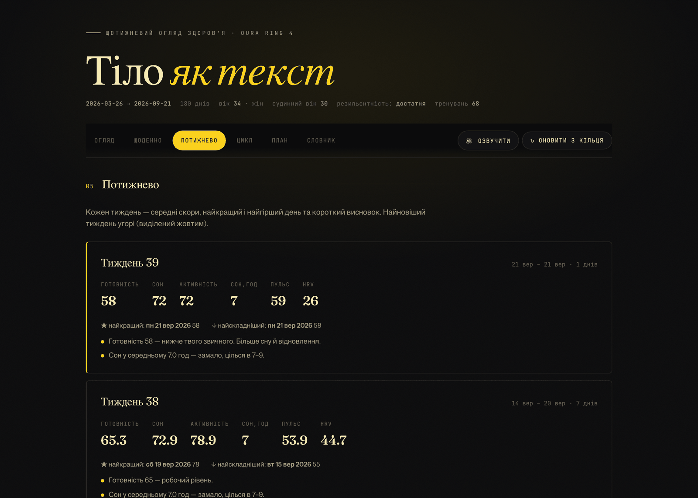
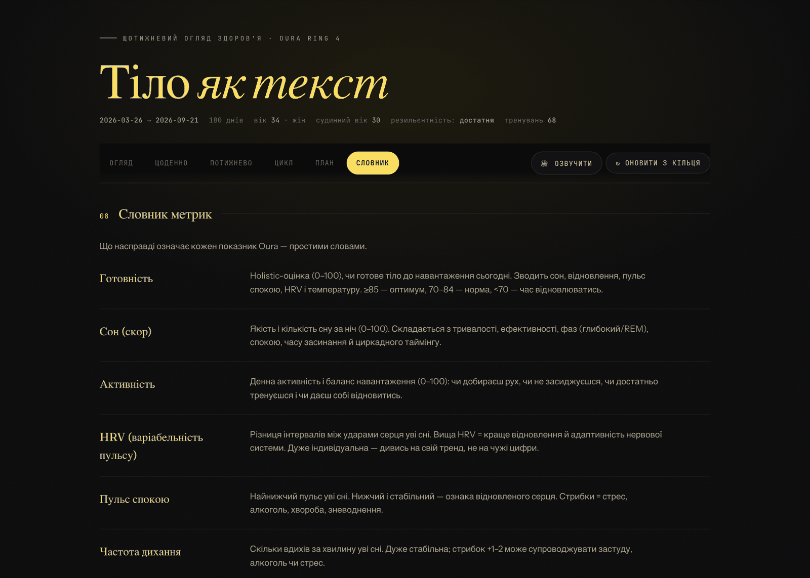

# Тіло як текст · Oura Health Dashboard

Приватний само-хостед дашборд для кільця **Oura Ring** — уся аналітика локально, нічого не йде на чужі сервери. Українською, з нейронною озвучкою й щотижневим AI-планом.

A private, self-hosted dashboard for your **Oura Ring** — all analytics stay on your machine. Ukrainian UI, neural voice read-aloud, and a weekly AI plan.

> ⚠️ Інформаційний інструмент із ваших власних даних, **не медичний діагноз**. Проєкт неофіційний, не пов'язаний з Oura Health.
> Informational tool built from your own data — **not medical advice**. Unofficial project, not affiliated with Oura Health.

---

**[Інструкція однією PDF-кою](docs/tilo-yak-tekst.pdf)** - покроково, з&nbsp;прикладами екранів, для людини без технічного досвіду.

## Що це вміє / Features

- **6 вкладок:** Огляд · Щоденно (всі показники + тлумачення) · Потижнево · **Цикл** (менструальний — фази, температурна крива, метрики по фазах, поради) · План на тиждень (AI-тренер) · Словник.
- **Усі дані локально** — експорт через офіційний Oura Cloud API v2 у JSON + CSV.
- **Тижневі рекомендації** на ваших **реальних кореляціях** (стрес→HRV, сон→готовність тощо).
- **Нейронна озвучка** будь-якої вкладки — природним українським голосом, **безкоштовно й без ключів** (Microsoft Edge TTS). Опційно — Azure / OpenAI.
- **Кнопка «Оновити з кільця»** прямо в дашборді + щотижневий авто-план.
- Редакторський дизайн (Fraunces + Instrument Sans), без зовнішніх залежностей, окрім Chart.js (CDN).

---

## Подивитися, як воно виглядає, ще не маючи кільця

У проєкті є генератор вигаданих даних - пів року сну, готовності, активності й циклу.
Жодного стосунку до реальних людей, зерно фіксоване, тож дані щоразу ті самі.

```bash
python3 make_demo_data.py
python3 build_dashboard.py && python3 serve.py
```

Коли захочеш свої справжні дані, видали теку `data/` і зроби звичайний `python3 oura_export.py`.
Щоб випадково нічого не затерти, генератор відмовляється працювати, якщо в `data/` уже щось лежить.

## Як це виглядає

| Огляд | Щоденно |
|---|---|
|  |  |

| Цикл | План на тиждень |
|---|---|
|  |  |

| Потижнево | Словник |
|---|---|
|  |  |

Дані на знімках вигадані - це той самий демо-набір.

---

## Найшвидший спосіб поставити — одна фраза

Якщо в тебе є [Claude Code](https://claude.ai/download), не треба жодної команди руками.
Відкрий його і встав це:

```
Постав мені дашборд для кільця Oura Ring.

1. Склонуй репозиторій https://github.com/hlyboki-sensy/oura-health-dashboard
   у мою домашню теку (якщо git недоступний — просто скачай архів і розпакуй).
2. Зайди в теку проєкту, прочитай файл CLAUDE.md і виконай усе, що там написано.

Я не програміст. Пояснюй простими словами, роби по одному кроку
і чекай на мою відповідь після кожного.
```

Далі він проведе тебе за руку. Повна покрокова інструкція для людини
без технічного досвіду — у файлі **[ЯК-ПОСТАВИТИ.md](ЯК-ПОСТАВИТИ.md)**
або тією самою **[PDF-кою](docs/tilo-yak-tekst.pdf)**, яку зручно переслати.

Хто хоче руками — нижче.

---

## 🇺🇦 Налаштування (5 хвилин)

**Потрібно:** Mac (macOS). Python 3.9+ уже є в системі.

1. **Залежності:**
   ```bash
   pip install requests edge-tts
   ```
2. **Зареєструй свій застосунок Oura** на https://developer.ouraring.com → *Create New* →
   Redirect URI: `http://localhost:8765/callback` → скопіюй **Client ID** і **Client Secret**.
3. **Конфіг:**
   ```bash
   cp config.example.json config.json
   ```
   Встав свої `client_id` і `client_secret`.
4. **Перший експорт** (відкриє браузер для входу в Oura):
   ```bash
   python3 oura_export.py
   ```
5. **Збери дашборд і відкрий:**
   ```bash
   python3 build_dashboard.py
   python3 serve.py        # → http://127.0.0.1:8910/
   ```
   На macOS можна просто двічі клікнути **`start.command`**.

**Оновлювати далі:** кнопка «↻ Оновити з кільця» в дашборді, або `python3 oura_export.py && python3 build_dashboard.py`.

### Щотижневий AI-тренер (опційно)
`coach_weekly.sh` щотижня оновлює «План на тиждень». Детермінований двигун працює завжди; для **глибокого** AI-розбору встанови [Claude Code](https://claude.com/claude-code) і зроби `claude login`. Постав на розклад (cron/launchd) — приклад у розділі English нижче.

### Голос
За замовчуванням — Edge TTS (голос `uk-UA-PolinaNeural`, без ключа). Зміни голос/швидкість у `tts_config.json` (`uk-UA-OstapNeural` — чоловічий). Для Azure/OpenAI див. `tts_config.example.json`.

---

## 🇬🇧 Setup (5 minutes)

**Requires:** a Mac (macOS). Tested on macOS only.

1. **Dependencies:** `pip install requests edge-tts`
2. **Register your Oura app** at https://developer.ouraring.com → *Create New* →
   Redirect URI `http://localhost:8765/callback` → copy **Client ID** & **Client Secret**.
3. **Config:** `cp config.example.json config.json` and paste your keys.
4. **First export** (opens browser to authorize): `python3 oura_export.py`
5. **Build & open:** `python3 build_dashboard.py` then `python3 serve.py` → http://127.0.0.1:8910/
   (or double-click `start.command` on macOS).

**Refresh later:** the “Оновити з кільця” (Refresh) button in the dashboard, or rerun the two commands.

### Weekly AI coach (optional)
`coach_weekly.sh` refreshes the weekly plan. The deterministic engine always works; for the **deep** AI write-up install [Claude Code](https://claude.com/claude-code) and run `claude login`. Schedule it weekly, e.g. macOS launchd or cron:
```bash
# crontab -e  → every Monday 08:30
30 8 * * 1 /bin/bash /path/to/coach_weekly.sh
```

### Voice
Defaults to free Edge TTS (`uk-UA-PolinaNeural`, no key). Change voice/rate in `tts_config.json`. Azure/OpenAI options in `tts_config.example.json`.

---

## Privacy / Приватність

Your health data **never leaves your computer**. `.gitignore` keeps `config.json`, `tokens.json`, and all `data/` out of git. The dashboard runs on `localhost` only.

The UI is in Ukrainian. Translations / PRs welcome.

## License
MIT © 2026 Olena Dubytska. Built with help from Claude.
